# HOF Redux 前端重构方案

> 状态：方案 + 静态视觉基线原型，尚未改动应用代码。
> 原型：[`ui-baseline/prototype.html`](ui-baseline/prototype.html)（在仓库内直接用浏览器打开）、候选样式表 [`ui-baseline/hof.css`](ui-baseline/hof.css)、截图 [`ui-baseline/screens/`](ui-baseline/screens/)。
> 依据：`legacy/class/class.main.php`、`class.char.php`、`class.battle.php`、`class.css_btl_image.php`、`class.auction.php`、`class.rank2.php`、`global.php`，`legacy/basis.css`、`legacy/style.css` 与 `public/image/` 原始素材；以及当前 `resources/views/**`、`public/*.css` 的实际渲染结果。

## 0. 结论摘要

1. **方向**：不换框架，不引入 SPA、Tailwind 或 Node 构建链。继续用 Blade 做服务端渲染，以旧版 `style.css` 的深蓝灰配色、15px 左竖条标题（h4）、毯子角色卡、`btn_bk01.gif` 按钮、浅蓝输入框和战报的双栏布局为视觉母版，重写一套带设计令牌、分层的 CSS（约 1,000 行），外加约 15 个 Blade 匿名组件。
2. **还原度**：桌面端保持 780px 定宽主框架、原菜单顺序和原页面分区；手机端（<600px）变成流式布局：三列菜单网格，表格改为卡片，输入框 16px，点击区域不小于 40px。
3. **重点改造**：战报改用内联 SVG 场景（移植 `cssimage` 的坐标算法，CSP 安全，并可随屏幕等比缩放），HP/SP 状态每 10 次行动一段，行动按队伍左右分栏；角色页恢复旧版分区顺序；商店、锻冶屋、拍卖恢复 NPC 头图和“买 / 卖 / 打工”子导航。
4. **先修硬伤**：分页巨型箭头、页头缺体力、中英文混杂、原始字段名外露（`armor`、`P_MAXHP`）、`<link>` 写在 `<body>` 内、标题层级被 `* {font-size:14px}` 抹平、CSS 缺少缓存失效机制。
5. **交付路径**：分 6 个阶段（F0–F5），先做基础层和组件，再逐页迁移，最后做视觉回归和可访问性验收。每阶段可独立合并，现有功能测试保持绿色。

## 1. 现状诊断

运行环境：PHP 8.4 容器 + SQLite 演示数据（演示用户 5 名角色，并有道具、一次狩猎、拍卖、留言、排行数据），Chromium 1280px / 390px 截图。截图存放在 `ui-baseline/screens/current-*.jpg`。**注意**：这不是 PostgreSQL 环境，也不是旧站运行截图；旧站视觉依据来自静态模板与素材取证，与 `architecture.md` §7 的要求一致。

| 当前首页（桌面） | 当前角色页（桌面，2,745px 高） | 分页组件 |
| --- | --- | --- |
| 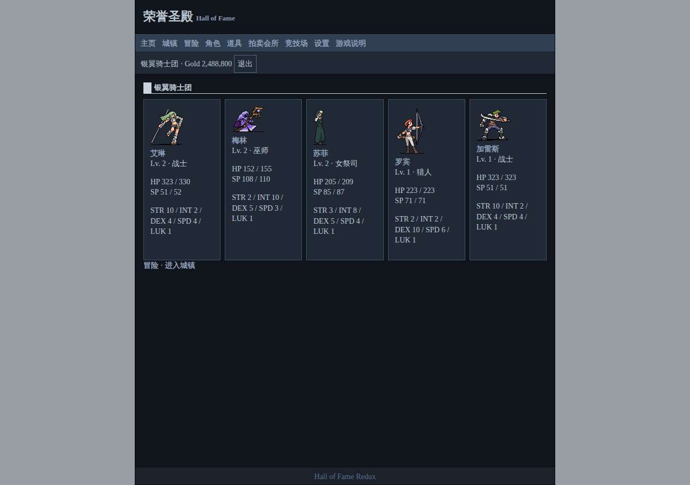 | 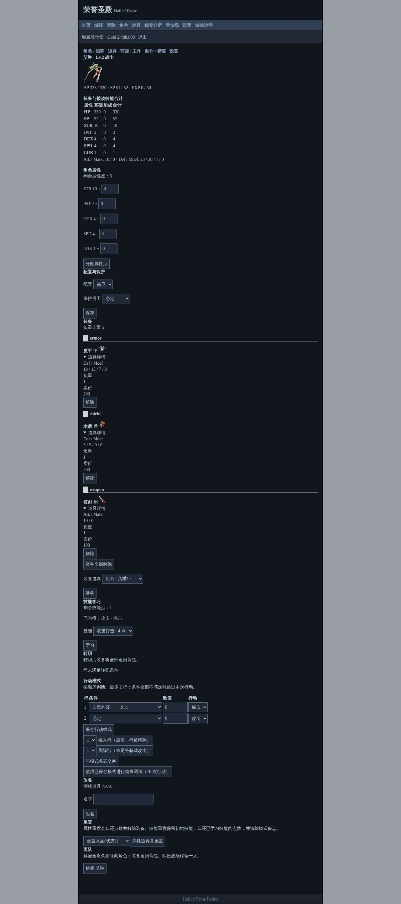 | 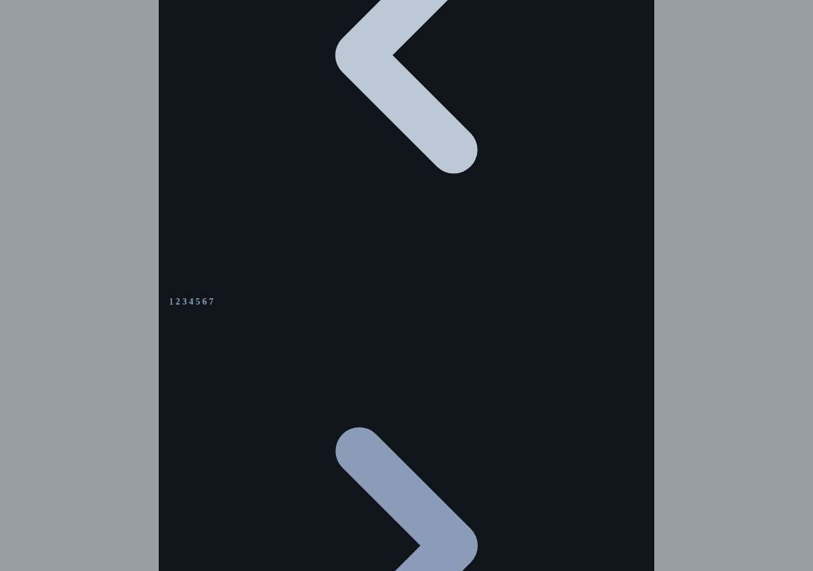 |

### 1.1 缺陷清单（按严重程度）

| 级别 | 问题 | 证据 / 原因 |
| --- | --- | --- |
| 阻断 | 分页渲染成两个占满整屏的箭头 | `{{ $records->links() }}` 使用 Laravel 默认的 Tailwind 视图，但项目没有加载 Tailwind；SVG 没有尺寸约束（`/catalog/*`、`/reports`、`/updates`、`/admin`） |
| 严重 | 标题层级失效：h2、h3、h4 字号相同 | `basis.css` 的 `* { font-size:14px }` 作用于所有元素；新视图混用 h2/h3/h4，只有 h4 带旧样式 |
| 严重 | 页头只显示 Gold，不显示**体力**；旧版 `#menu2` 同时显示“资金 / 体力” | `layouts/app.blade.php` |
| 严重 | 菜单与旧版不一致，并与“城镇”内的设施重复：主页 城镇 冒险 角色 道具 拍卖会所 竞技场 设置 游戏说明，另有二级 `player-nav` | 旧版为 首页 狩猎 道具 城镇 设置 记录（`class.main.php:MyMenu`） |
| 严重 | 原始键名直接显示：装备栏显示 `armor/shield/weapon`，道具详情显示 `P_MAXHP` 等字段名 | `player-character.blade.php`、`player-item.blade.php` |
| 严重 | 中英文混杂：`Listing fee…`、`No boss instances initialized.`、`Current password`、`Delete account permanently`、`Respawns … UTC` 等 | auction/boss/account/ranking 视图 |
| 严重 | 战报：两块半透明白底面板压在背景图上，与原版的“场景图 + HP/SP 行 + 双栏行动”结构不符；82 条行动排成一个编号列表 | `battle/show.blade.php`、`battle.css` |
| 中 | 每个 `<label>` 都是块级元素，上下外边距各 14px，表单被拉得很长（商店页 3,747px，角色页 2,745px） | `app.css: label{display:block;margin:14px 0}` |
| 中 | 输入框改成深色，丢掉了旧版标志性的浅蓝 `.text` 输入框；按钮也丢掉了 `btn_bk01.gif` 底纹 | `app.css` |
| 中 | 表格没有表头底色和网格线，数字没有右对齐 | 无 `.td6/.td7` 对应样式 |
| 中 | `<link rel="stylesheet">` 写在 `<body>` 内（battle.css、catalog.css），会引起样式闪烁 | `battle/show`、`information/catalog` |
| 中 | CSS 缓存 7 天（`nginx.conf`），但文件名不带版本号，样式更新后用户看不到 | `docker/nginx.conf` |
| 中 | 选择出战队伍的界面有 4 套不同实现（狩猎、BOSS、竞技场、角色列表），都是裸复选框 | `world/party`、`boss`、`ranking`、`player` |
| 中 | 城镇用 166×370 的竖图 `town.gif` 替代了旧版右上角的 `town02.gif` 背景布局 | `community/town.blade.php` |
| 中 | 时间显示为原始 UTC 字符串 `2026-10-05 18:15:04`，拍卖“结束 (UTC)”列没有剩余时间 | auction、town、reports |
| 低 | 视图里有业务调用：`App\Application\Player\PlayerRules::…`、`AuctionService::minimumBid()`、`app(BattlePresenter::class)` | 多个视图 |
| 低 | `operation_id` 隐藏字段手写了 20 多次，`url()` 与 `route()` 混用 | 全部 POST 表单 |
| 低 | 留言颜色偏好可以保存但从未渲染；注册时默认值 `bdc8d7` 不在旧版 216 色表内；注册写入 `inventory_javascript`，设置页读取 `no_js_inventory`，两者键名不一致 | `AuthController`、`PlayerService` |

### 1.2 结构性问题

- 885 行 Blade，没有一个组件；`layouts/app.blade.php` 把整个外壳写在 8 行里。
- 4 个 CSS 文件规则互相覆盖：旧版 `basis.css`/`style.css`、单行 `app.css`、`battle.css`、`catalog.css`。
- CSP 为 `style-src 'self'; script-src 'self'`，因此**禁止内联 style 属性和内联脚本**。现有方案没有针对这一约束的策略，例如旧版战斗场景完全依靠内联坐标。

## 2. 设计原则

1. **原版优先**：配色、标题样式、毯子、按钮底纹、菜单顺序、页面分区、战报结构都以旧版为准。只有可读性、可访问性和安全性需要时才偏离，并在本文写明原因。
2. **安静的界面**：深色底、浅灰蓝字，强调色只有金色（帮助、属性点）和战斗语义色（伤害 / 恢复 / 辅助 / 魔法 / 蓄力）。不加渐变卡片、阴影、圆角或动画。
3. **像素素材是主角**：角色、怪物、图标、背景一律保持原始像素尺寸。缩小时等比缩放，不做裁切，不加滤镜。
4. **信息密度适中**：沿用旧版 15px 页边距和 20px 缩进，正文行高从 140% 提到 160%（中文更舒适），表单改为“右对齐标签 + 控件”的两列网格，不再每个字段占三行。
5. **无 JS 可用**：所有功能都能纯 HTML 表单完成；JS 只做渐进增强。
6. **一处定义**：颜色、字号、术语、金额和时间格式都只定义一次（CSS 令牌、Blade 组件、术语表）。

## 3. 视觉语言（设计令牌）

候选实现见 `ui-baseline/hof.css` 的 `:root`。

### 3.1 颜色

| 令牌 | 值 | 来源 | 对 `#10151b` 对比度 | 用途 |
| --- | --- | --- | --- | --- |
| `--hof-page` | `#98a0a5` | `style.css body` | — | 页面外底色（框架两侧） |
| `--hof-frame` | `#10151b` | `#main_frame` | — | 主框架底色 |
| `--hof-edge` | `#070b0e` | 边框 / `.divide` | — | 框架边线、分隔线 |
| `--hof-menu` | `#304052` | `#menu`、`.td6` | — | 菜单底色、表头、表格线 |
| `--hof-menu2` | `#202935` | `#menu2`、`.tdToggleBg` | — | 状态栏、选中行 |
| `--hof-foot` | `#1b222c` | `#foot` | — | 页脚 |
| `--hof-text` | `#bdc8d7` | `body color` | 10.8 | 正文 |
| `--hof-rule` | `#cad3df` | `h4` 边框 | — | 标题竖条与下划线 |
| `--hof-link` / `-hover` | `#8a9cb7` / `#cbd3de` | `a` | 6.6 / 12.2 | 链接（粗体，悬停时加下划线） |
| `--hof-help` / `-hover` | `#c69500` / `#ffcc33` | `.a0` | 6.7 | 帮助“?”、焦点环 |
| `--hof-field` | `#91a2bb`（文字 `#10151b`） | `.text`、`select` | 7.1 | 输入框 |
| `--hof-cell-1/2/4/5/9` | `#242f3c` 等 | `.td1–.td9` | — | 面板、交替表格 |

**为可读性调整的令牌**（色相不变，只提高亮度；旧值保留为 `--hof-decor` 等，只用于装饰）：

| 令牌 | 旧值 → 新值 | 旧 / 新对比度 | 说明 |
| --- | --- | --- | --- |
| `--hof-muted` | `.light #40526a` → `#7d90ab` | 2.3 → 5.6 | 旧值几乎看不清，只保留作装饰色 |
| `--hof-unselect` | `#506685` → `#6f84a3` | 3.1 → 4.8 | 未选中角色名 |
| `--hof-menu-link` | `#8a9cb7` → `#a3b3c8`（在 `#304052` 上） | 3.8 → 5.0 | 菜单文字 |
| `--hof-dmg` | `#cc3300` → `#e0653d` | 3.5 → 5.3 | 伤害 / 物攻 |
| `--hof-recover` | `#3366ff` → `#6b8cff` | 3.9 → 6.0 | 恢复 / 物防 / 生命 |
| `--hof-spdmg` | `#993399` → `#c27ac2` | 2.9 → 6.0 | 魔攻 / 中毒 |
| `--hof-support`、`--hof-charge`、`--hof-levelup` | 不变 | 9.1 / 12.2 / 17.1 | 辅助、蓄力、升级 |
| `--hof-error` | `red` → `#ff6b5e` | 4.6 → 6.6 | 错误 |

是否采用调整值需要产品负责人确认（§15 D-UI-1）。备选方案是正文用调整值，战报大字号胜负标题保留原色。

### 3.2 字体与字号

- **字体栈**：`"Microsoft YaHei", "微软雅黑", "PingFang SC", "Hiragino Sans GB", "Noto Sans CJK SC", "Source Han Sans SC", "WenQuanYi Micro Hei", system-ui, sans-serif`。第一项与旧版 `basis.css` 一致，后面依次兜底 macOS、Linux 和 Android。
- **不加载 Web 字体**：CSP 不允许外部字体；自托管中文字体每种字重有数 MB，收益不抵成本。
- **字号**：12（辅助 / 表格注释）、13（次要信息 `.meta`）、**14（正文，旧值）**、16（页面标题）、28（战报胜负，对应旧版 200%）。手机端正文 15px，输入框 16px，避免 iOS 聚焦时自动放大。
- **行高**：正文 1.6，表格和战报 1.45–1.5，标题 1.5。
- **数字**：金额、HP/SP、属性和价格使用 `font-variant-numeric: tabular-nums`，并在表格中右对齐。
- **粗细**：链接保持旧版粗体；正文 400；标题、角色名、道具名 700。

### 3.3 间距、尺寸、形状

- 间距刻度：4 / 8 / 12 / **15（页边距）** / **20（缩进，旧版 `margin:0 20px`）** / 32。
- 主框架宽 780px（旧值）。820px 以下改为全宽并去掉左右边框；600px 以下切换为手机布局。
- 不使用圆角。按钮、输入框、表格都是直角，与旧版一致。
- 点击区域：桌面 ≥ 28–32px，手机 ≥ 40px。

### 3.4 素材

- 标题：使用 `title03.gif`（218×45，原版标题图），`alt="荣誉圣殿 Hall of Fame"`，替换现在的文字 h1。
- 角色、怪物：`image/char/*`；战场右侧队伍用 `image/char_rev/*`，缺图时由 SVG `transform="scale(-1,1)"` 镜像兜底。
- 毯子：`carpet010/011.gif`（138×46）交替；怪物脚下是 `other/land_*.gif`（134×67）。
- 图标：`image/icon/*`（24×24 / 32×32），道具和技能前统一显示。
- NPC：店 `ori_002.gif`、拍卖 `ori_003.gif`、精炼 `mon_053r.gif`、制作 `mon_053rz.gif`。
- 排名：`crown01–03.png`。
- 城镇：`other/town02.gif` 作为右上角背景（旧 `.town`）。
- 登录页：`top01.gif` 加旧版介绍文案。

## 4. 布局、导航与响应式

### 4.1 页面外壳（对应 `class.main.php:Head/MyMenu/Foot`）

```
┌──────────── .frame（780px，居中；820px 以下全宽）────────────┐
│ .title      [title03.gif]                                      │
│ .menu       首页 │ 狩猎 │ 道具 │ 城镇 │ 设置 │ 记录 (│ 管理)   │
│ .status     银翼骑士团      资金 $ 2,488,800   体力 ▰▰▰▱ 87/100   退出 │
│ .contents   [提示条] 页面内容……                                 │
│ .foot       UpDate - 手册 - 教学 - 游戏数据 - Top              │
└───────────────────────────────────────────────────────────────┘
```

- 访客菜单：首页（登录页）│ 新注册 │ 规则和手册 │ 游戏数据 │ 战斗记录；状态栏显示“欢迎来到 [ 荣誉圣殿 ]”。
- 首次登录（尚未建队）：菜单显示“首次登录游戏，感谢您的加入！”，状态栏显示“现在让我们认识一下你吧：”，与旧版一致。
- 当前页加 `aria-current="page"`：文字提亮，并加 2px 底线。
- 页脚用 flex 布局固定在底部，取代旧版 `position:absolute` 加 `padding-bottom:6em` 的做法。
- 体力显示：用原生 `<meter>` 绘制进度条（CSP 不允许内联宽度）。数值来自只读计算，不写库，见 §6.0。
- 提示：`session('status')` 显示为绿色 `.notice-ok`（旧 `.result`），`$errors` 显示为红色 `.notice-err`（旧 `.error`）。两者都放在内容区顶部，分别带 `role=status` / `role=alert`。

### 4.2 信息架构（菜单 → 路由）

| 菜单 | 页面 | 当前路由 | 调整 |
| --- | --- | --- | --- |
| 首页 | 角色毯子、教程提示 | `/` | 保留 |
| 狩猎 | 普通地图、BOSS、BOSS 战记录 | `/hunt` | BOSS 列表合并进本页（旧 `HuntShow`）；`/bosses/{id}` 为挑战页 |
| 　└ 地图 | 选队 + 出现敌人 | `/hunt/{area}` | 保留 |
| 　└ 模拟战 | 镜像战 | `/simulation` | 入口放在角色页“行动模式”区 |
| 道具 | 背包（武器 / 防具 / 道具 / 其他） | `/inventory` | 分类改为旧版 `JS_ItemList` 的四类 |
| 城镇 | 设施列表 + 广场 | `/town` | 恢复 `town02.gif` 背景布局 |
| 　└ 店 | 买 / 卖 / 打工 | `/shop` | 拆为 `/shop`（买）、`/shop/sell`、`/shop/work` 三个标签页（同一控制器） |
| 　└ 人材斡旋所 | 招募 | `/characters` | 改名为“人材斡旋所”，显示招募卡片 |
| 　└ 锻冶屋 | 精炼工房 / 制作工房 | `/crafting` | 拆为 `/smithy/refine`、`/smithy/create`（旧路由 302） |
| 　└ 拍卖会场 | 列表 / 出品 / 记录 | `/auction` | 保留 |
| 　└ 竞技场 | 排行 / 登记 / 挑战 / 记录 | `/ranking` | 保留 |
| 设置 | 显示设置、队伍改名、密码、删除账号 | `/account` + `/preferences` | 合并为一页（`/preferences` 302 到 `/account`） |
| 记录 | 普通 / BOSS / 竞技场 | `/reports` | 保留，标签页样式 |
| 页脚 | UpDate / 手册 / 教学 / 游戏数据 | `/updates`、`/manual`、`/manual/tutorial`、`/catalog` | 保留 |
| 管理（仅管理员） | 管理控制台 | `/admin` | 菜单末尾追加 |

路由调整只涉及 GET 展示页，所有 POST 命令路由不变。旧路径保留 302，测试相应更新。

### 4.3 断点

| 区间 | 布局 |
| --- | --- |
| ≥ 820px | 780px 定宽框架居中，两侧露出 `#98a0a5` 底色（旧版观感） |
| 600–819px | 框架全宽，无左右边框，其余与桌面相同 |
| < 600px | 手机布局：菜单变为 3 列网格（每格 42px 高），状态栏两行，表单单列，表格变卡片，毯子每行 3 个，战报单栏 |
| 打印 | 隐藏菜单、状态栏、操作按钮，白底黑字（便于打印战报） |

### 4.4 手机端表格策略

- **卡片化**（`.tbl-stack`，商店、出售、拍卖、背包、管理用户表）：`td.primary`（道具描述）作为卡片标题，其余单元格带 `data-label` 并排成一行。参见 `proposed-mobile-shop.jpg`。
- **专用重排**（行动模式表）：第 1 行放条件下拉框，第 2 行放“数值 + 行动”，右侧是行选择单选框。
- **横向滚动兜底**（`.tbl-wrap`）：只用于管理审计这类低频宽表。

## 5. 组件清单（Blade 匿名组件，`resources/views/components/`）

只为重复出现的复杂结构建组件；按钮、输入框这类简单元素直接用 CSS 类，不包装成组件。

| 组件 | 参数 | 渲染 | 旧版来源 | 替换的现有代码 |
| --- | --- | --- | --- | --- |
| `<x-sec>` | `title`, `help`（手册锚点）, `as`=h1/h2, slot `aside` | 15px 左竖条标题 + 金色“?” + 右侧附注 | `h4` + `.a0` | 全部 h2/h3/h4 |
| `<x-op/>` | — | `@csrf` + `operation_id`（UUID） | — | `player-token` 与 20 多处手写隐藏字段 |
| `<x-carpet>` | `unit`(name, level, job, img), `href?`, `star?`, `land?`, `vitals?` | 毯子 / 土地 + 像素图 + 名字 + Lv/职业 | `ShowChar*`、`ShowCharWithLand` | home、player、party、boss 等 |
| `<x-party-picker>` | `characters`, `selected`, `name='party[]'`, `positions` | 整张毯子卡是 `<label>`；未选中时名字变暗（`:has(:checked)`） | `ShowCharRadio` + `toggleCheckBox` | 4 套选队实现 |
| `<x-item>` | `data`, `qty?`, `compact?` | 图标 + `+N` + 名称 + (类型) + x数量 + 彩色属性 + 重量 + 附加能力 | `ShowItemDetail()` | `player-item` |
| `<x-skill>` | `skill`, `learn?` | 图标 + 名称 + SP + 学习点数 | `ShowSkillDetail()` | 技能下拉框 |
| `<x-npc>` | `img`, slot | 头像 + 对白 + 子导航 | `ShopHeader`、`AuctionHeader`、`Smithy*Header` | — |
| `<x-tabs>` | `items`（label, href, active） | “买 / 卖 / 打工”样式子导航 | 旧版 `/` 分隔链接 | `player-nav`、记录分类、资料分类 |
| `<x-money>` | `amount` | `$ 1,234`（`tabular-nums`） | `MoneyFormat()` | 散落的 `number_format` |
| `<x-time>` | `at`, `mode`=short/relative/full | `<time datetime>`，显示为 `10-05 12:15` 或“5小时12分” | `date("m/d H:i")` | 原始 UTC 字符串 |
| `<x-confirm>` | `word`=DELETE/RUN | 输入确认词的危险操作字段 | — | 管理和账号删除 |
| `<x-kv>` | `rows` | 右对齐“标签 : 值”列表 | `ShowCharDetail` 表格 | — |
| `battle/stage` | `snapshot` | SVG 战斗场景 | `cssimage::Show` | `battle.css` 白板 |
| `battle/hpsp` | `unit` | 名称（蓄力 / 咏唱）+ 生命 / 魔力 | `char::ShowHpSp` | — |
| 分页视图 | — | `vendor/pagination/hof.blade.php`，并在 `AppServiceProvider` 中设置 `Paginator::defaultView()` / `defaultSimpleView()` | — | Tailwind 默认视图 |

**表现层逻辑的位置**：视图只读取明确的数据。以下逻辑改由控制器或现有应用服务提供：`PlayerRules::slot/capacity/isTacticAction`、`AuctionService::minimumBid`、`BattlePresenter::present`、`CatalogPresenter::card`。道具彩色属性行由 `ItemDetails` 新增的 `summary(array $data): array` 生成，返回 `[{tone, text}]`，并为它写单元测试。槽位名称和属性名称统一从术语表取（§8）。

## 6. 逐页方案

每页注明：旧版依据 → 结构 → 组件 → 后端改动 → 手机端。截图见 `ui-baseline/screens/proposed-*`。

### 6.0 全局（布局与 HUD）
- `layouts/app.blade.php` 拆为 `partials/{head,menu,status,flash,foot}.blade.php`。新增 `@stack('head')`，页面专属的样式表一律放进 `<head>`。
- 由 `View::composer('layouts.app')` 提供 `$hud`：队伍名、资金、当前体力、是否管理员、菜单数组。菜单的激活状态由 `request()->routeIs()` 判断。
- 体力：把 `GameAction::stamina()` 中的公式提取为纯函数 `GameAction::availableStamina(User $u, CarbonImmutable $now): int`。扣费逻辑和 HUD 共用这一个函数，HUD 只读不写库。

### 6.1 登录 / 访客首页（`LoginForm`）
- 两栏：左边是 `top01.gif` 加“这到底是什么游戏? / 战斗的感觉是什么?”介绍，右边是登录表单（ID / PASS 右对齐标签）加前 5 名排行（皇冠图标、战绩、胜率），下方“提示”区显示用户数。
- 后端：`/login` 由 `Route::view` 改为控制器，或用 composer 提供排行前 5 名。
- 手机：登录表单排在最前，介绍和排行在下方。
- 注册页沿用同一外壳，规则说明写在表单旁边（中文）。

### 6.2 初始设置（`FirstLogin`）
- “队伍名称”区和“第一个角色”区各用 `<x-sec>`。职业以 `.td1` 卡片呈现，每张卡同时显示男、女两种立绘，并带单选框；性别单独一组单选（与招募页一致）。提交字段仍为 `base_type` 和 `gender`，后端不改。

### 6.3 首页（`LoginMain`）
- 注册后 1 小时内显示教程提示，然后是 `<x-sec>` 队伍名和 5 列毯子（手机 3 列）。毯子下显示名字（有未分配属性点时加金色 `*`）、`Lv.N 职业`，以及小字两行 `HP a / b`、`SP c / d`。
- `HomePresentationTest` 断言的 `HP a / b` 文本格式保持不变。

### 6.4 角色详情（`CharStatShow`，按旧版分区顺序）
1. 顶部切换角色链接、页内目录（人物状态 / 角色属性 / 行动模式 / 位置 / 装备 / 技能 / 其他）。
2. **人物状态**：毯子 + `<x-kv>`（经验、生命、魔力、力量、智慧、敏捷、速度、幸运，加成以绿色 `+ N` 显示）+ 特殊能力（毒抵抗、无视防御、召唤力）。
3. **角色属性**（仅在有剩余点数时显示）：5 列数字输入框，按钮“升值”。
4. **行动模式**：表格（No / 条件 / 数值 / 行动 / 选择）。按钮“确定模式”“设置 & 测试”和“模拟战斗”链接在第一行；“切换模式”“添加”“删除”在第二行。添加和删除通过同一个表单中的 `<button formaction="…tactics-insert">`、`formaction="…tactics-delete">` 提交，行号取自选择列的单选框。这样就不再需要现在的两个独立表单，体验与旧版一致。需要确认 `tactics-insert/delete` 的校验会忽略表单里多余的 `tactics[*]` 字段。条件下拉框中的分组标题沿用旧版 `.select0` 底色。
5. **位置 & 保护**：前卫 / 后卫单选，护卫策略下拉框。
6. **装备**：当前能力（物攻 dmg、魔攻 spdmg、物防 recover、魔防 support、负重 charge，配色同旧版），槽位表（武器 / 盾 / 甲 / 道具，单选 + `<x-item>`，按钮“卸下”“全卸”）；可装备道具放在 `<details>` 里，以单选列表加“装备”按钮呈现。
7. **技能**：掌握技能列表、可学技能单选列表（`<x-skill>` 显示学习点数）、“习得”；**转职**以职业立绘卡片加单选框呈现（旧版样式）。
8. **其他**（`<details class="danger-zone">`）：改名、重置、离队。
- 测试中出现的文案（“装备与被动技能合计”“条件全部不满足时跳过本次行动”）要么在新结构中保留，要么同步修改测试，并在提交说明中写明。

### 6.5 狩猎（`HuntShow` / `MonsterShow`）
- `/hunt`：“普通怪物”区以内联链接列出地图（间距 32px，旧样式），时限地图显示开放时间；“BOSS”区显示存活 BOSS 的毯子加冷却倒计时；“BOSS战记录”区显示最近 15 条，并附“全表示”链接。
- `/hunt/{area}`：标题行显示地图名、体力消耗和“返回地图列表”链接；`<x-party-picker>`；按钮“战斗!”（大按钮）、“重置”和“保存此队伍”勾选框（居中）；“出现敌人”区以 `land_*.gif` 毯子展示怪物。
- 后端：把 `MultiplayerController@bosses` 中只投影展示字段的查询（id、名称、等级上限、存活、复活时间；不含 HP/SP）移到 `BossService::summaries()`，供狩猎页和 BOSS 页共用。隐藏 HP 的规则不变。

### 6.6 BOSS（`UnionShow`）
- BOSS 立绘放在 `land_sea` 上，下方显示等级上限、存活或复活时间（`<x-time>`）、冷却，再接 `<x-party-picker>` 和“战斗!”。HP/SP 在服务端过滤，不渲染（`CompetitionTest` 已有断言）。

### 6.7 战报（见 §7）

### 6.8 战斗记录列表（`BattleLogDetail`）
- `<x-tabs>`（普通 / BOSS / 竞技场）。每条一行：`[ 10/05 12:15:04 ] 战斗 34 回合 [胜] 队伍(人数:平均等级) vs 对手(…)`，胜方队名用 recover 色，败方用 dmg 色。使用新分页视图。

### 6.9 道具（`ItemShow`）
- 分类标签：全部 / 武器 / 防具 / 道具 / 其他（与旧版 `JS_ItemList` 分组规则一致，服务端 `?category=` 过滤）。选“全部”时按分类分段列出。每项一行 `<x-item>`。设置页的“展开全部道具详情”控制附加说明是否默认展开。

### 6.10 店（`ShopHeader` / `ShopBuyShow` / `ShopSellShow` / `WorkShow`）
- 顶部 `<x-npc img=ori_002>`：“欢迎光临ー”加 `<x-tabs>` 买 / 卖 / 打工。
- 买：表格列为 ☐ / 价格 / 数 / 道具（旧版列序）。勾选后整行高亮（`tr:has(:checked)`，替代旧版 `toggleCSS` 脚本），数量默认 1。注意：需要把提交语义从“数量 > 0 即购买”调整为“勾选 + 数量”，或保留现语义并去掉勾选列（D-UI-4）。
- 卖：列为 ☐ / 卖价 / 持有 / 数 / 道具。
- 打工：“100 体力 → $ 500”说明加大按钮，当前体力不足时按钮禁用并说明原因（服务端仍会校验）。
- 手机：卡片化。

### 6.11 锻冶屋（`SmithyRefine*` / `SmithyCreate*`）
- 精炼：`<x-npc img=mon_053r>` 加旧版台词（“在这里可以进行物品的精炼！……弟弟在管理的制作工房在这边。”）；单选道具列表（显示 `+N` 和每次费用）、次数输入框；成功率表格（+1–+4 100% …… +10 10%）；精炼结果用 `<ol>` 逐次显示成功 / 失败。
- 制作：`<x-npc img=mon_053rz>`；配方单选列表（成品 `<x-item>` + 材料图标 × 需要量（持有量），对应旧版 `ShowItemDetail($need)`）；追加材料下拉框。

### 6.12 人材斡旋所（`RecruitShow`）
- 4 张职业卡片（`.td1` 底色，男女立绘并排，单选，价格），卡片下方用 `.td4/.td5` 交替条显示职业名；名字输入框、性别单选、“雇佣”。达到上限时显示旧版提示。右侧小字显示当前队员 `n / 5`。

### 6.13 拍卖会场（`AuctionHeader` / 列表 / `AuctionFoot`）
- `<x-npc img=ori_003>`：非会员时显示入会费和“入会”按钮；会员时显示“欢迎您到拍卖场”、规则摘要和“回顾记录 · 出品”链接。
- “道具拍卖(Item Auction)”表格：No / 其余（剩余时间，不足 1 小时标红）/ 价格 / Item（`<x-item>` + 描述 + 出价表单）/ Bids / 投标人 / 参展人。列头即排序链接，当前排序加 ▲▼。
- “出品”区（会员可见）使用表单网格；“拍卖纪录(AuctionLog)”区为时间线列表。
- 测试断言的 `Auction` 文本由标题“拍卖(Auction)”保留。

### 6.14 竞技场（`RankShow`）
- 排行表（皇冠图标 / N位 / 底，队伍和“(N战 N胜N败 N引 N防 胜率N%)”，自己队伍加粗并下划线），旧版“RANKING / Nearly”双栏在桌面并排、手机上下排列。下方依次是登记队伍（`<x-party-picker>`）、下次可挑战时间（`<x-time relative>`）、“挑战”按钮和挑战记录。标题“竞技场(Ranking)”满足现有测试断言。

### 6.15 城镇与广场（`TownShow` / `TownBBS`）
- “街”区：设施树（店(Shop) → 买 / 卖 / 打工；人材斡旋所；锻冶屋 → 精炼 / 制作；拍卖会场；竞技场），右上角背景 `town02.gif`。手机端背景改为顶部横幅（按 62.2% 比例留出空间）。
- 公告（如有）用 `.panel` 显示；“广场”区：单行输入框加“发言”，留言格式 `队名 > 内容 (10-05 12:15)`。若接受 D-UI-3，队名按发言者所选颜色显示（`.uc-RRGGBB` 类）。

### 6.16 设置（`SettingShow`，合并 `/account` 与 `/preferences`）
- 分区依次为：显示设置（记录战斗、展开道具详情、留言颜色：216 色网格单选，以色块预览）、队伍改名（费用 `$ 100,000`）、修改密码、删除账号（`.danger-zone` + `<x-confirm word=DELETE>`）。

### 6.17 手册 / 教学 / 更新 / 游戏资料
- 手册和教学：`<x-tabs>` 切换，正文最大行宽约 40 个汉字，h4 风格分节，插图居中（`image/manual/*`）。旧手册内容的翻译和编码问题不在本方案范围内，见 `feature-inventory.md`。
- 更新公告：时间线（标题、`<x-time>`、正文）。
- 游戏资料：保留 `CatalogPresenter` 卡片，样式并入主样式表，采用两列网格（手机单列）并使用新分页视图。`CatalogPresentationTest` 用 `assertDontSee('<h3>'.$name.'</h3>')` 判断条目被隐藏，若卡片标题改用 `<x-sec>` 或改变 h3 结构，这些断言会“假通过”，必须同步改为基于稳定 `data-id` 的断言。

### 6.18 管理控制台
- 沿用同一外壳，菜单中出现“管理”。页内依次为：统计（`.kv`）、账号表（`.tbl-stack`，可点击进入）、公告发布、审核列表（每条后附 `<x-confirm>`）、战报清理、维护、审计日志（`.tbl-wrap` 横向滚动，`details` 以格式化 JSON 显示，不再直接 `json_encode` 输出单行）。

## 7. 战报渲染方案

参考旧版 `class.battle.php`（`BattleHeader`、`Process` 第 213 行每 `BATTLE_STAT_TURNS=10` 次行动输出一次 `BattleState`、`Action`、`BattleResult`）和 `class.css_btl_image.php`。

### 7.1 页面结构（与旧版一致）

1. **双方概况**（两栏）：左边是 team1（对手 / 防守方），右边是 team0（玩家 / 挑战方），各显示总级别、平均级别、总 HP。BOSS 方显示 `????/????`。
2. **战况段**（每 10 次行动一段，第 0 次行动也输出一段）：
   - SVG 场景（背景、魔法阵、单位、阵亡图 `mon_145.gif`；阵亡的召唤物不显示）；
   - 右下角 `« »` 锚点跳转到上一段或下一段（纯 HTML，对应旧版 `#sN`）；
   - HP/SP 行：左栏为对手（后排 | 前排），右栏为我方（前排 | 后排）。每个单位显示名字（阵亡标 dmg 色、中毒标 spdmg 色、蓄力或咏唱时加金色括注），下面是“生命 a/b”（recover 色）和“魔力 c/d”（support 色）。
3. **行动行**：每次行动占一行两栏，对手的行动写在左栏，我方写在右栏。行首是“行动者 [技能图标] 技能名”（下划线），下面逐行列出结果（保护、伤害 dmg、恢复 recover、状态变化、被打倒、掉落）。数值变化可显示为 `(250 > 240)`；BOSS 方显示 `(??? > ???)`。
4. **结果**：居中大字“XX 胜利!”或“平局”，对应旧版 `font-size:200%`。下面是两栏汇总：残留 HP、存活、总伤害、总经验值、金钱、战利品（带图标）。升级提示用 levelup 黄色。
5. 操作：“再战一次”（相同队伍）、“返回狩猎”、“战斗记录”。

### 7.2 数据：扩展 `BattlePresenter`

报告中已经有 `initial_teams`、按序号排列的 `events`（含 `actor/target/before/after/tick`）和 `background`。`present()` 将输出：

```php
[
  'header'   => [side => ['name', 'total_level', 'average_level', 'hp', 'maxhp']],   // side: 'foe' | 'ally'
  'segments' => [[ 'index' => n, 'stage' => [...sprites], 'units' => [side => [front => [...], back => [...]]],
                   'actions' => [[ 'side', 'actor', 'skill' => [name, icon], 'lines' => [[tone, text]] ]] ]],
  'result'   => ['winner_side', 'label', 'summary' => [side => [...]], 'items' => [...], 'levelups' => [...]],
]
```

- 状态重建：从 `initial_teams` 出发，按事件的 `after` 值逐步更新 HP/SP、状态、位置、蓄力和召唤，每遇到第 10 次 `ActorSelected` 就生成一份快照。这是纯函数，可以针对固定种子报告写单元测试。
- **隐藏信息（高风险）**：`BattleService::publicReport()` 是**先**调用 `present()`，**再**剔除 `initial_teams`、`boss_hp` 和事件中的 `before/after`。也就是说，`present()` 拿到的是完整数据。因此分段快照必须在 presenter 内部对 `boss` 单位屏蔽 HP/SP（输出 `????`），数值变化显示为 `(??? > ???)`，概况和汇总里的总 HP 也要屏蔽。增加测试：用真实 BOSS 战报渲染页面，断言 BOSS 的任何 HP/SP 数值（初始值、每段快照值、最终值）都不出现在 HTML 中。
- 现有的 `lines`/`tone` 输出保留，供列表摘要等场景使用。

### 7.3 SVG 场景：移植 `cssimage`（CSP 安全）

- 画布为 `viewBox="0 0 480 200"`（背景图原尺寸），用 `<svg class="stage" role="img" aria-label="第 N 段战况：…">` 输出。SVG 的 `x/y/width/height/transform` 是表现属性，不是 `style`，CSP 允许；`<image href>` 受 `img-src 'self'` 约束，同样允许。
- 坐标算法逐行移植 `CopyRow()`：画布宽 6 等分（cell = 80）。左方后排在第 1 格、前排在第 2 格（`direction=0`）；右方前排在第 4 格、后排在第 5 格（`direction=1`）。每排 n 个单位，`gap_x = 80/(n+1)·(±1)`，`gap_y = 200/(n+1)`，坐标再减去图片宽高的一半。魔法阵分别为 `mc0_N.gif`（x=280）和 `mc1_N.gif`（x=0）。
- 图片尺寸由 `getimagesize()` 读取（与旧版相同），加静态缓存。路径只接受内容中登记的文件名（`basename` + 白名单目录）。
- 样式：`max-width:480px; width:100%; aspect-ratio:12/5`。手机端自动等比缩小（参见 `proposed-mobile-battle.jpg`），桌面端保持 1:1 像素。
- 排列算法放在 `App\Application\Battle\BattleStage`（纯 PHP），单元测试覆盖 1–5 人一排、阵亡、召唤阵亡隐藏、缺少 `char_rev` 素材时镜像兜底等情况。

### 7.4 手机端
- 概况、HP/SP 两栏保持并排（每栏内前后排纵向排列）。行动行改为单栏，用左侧 3px 色条区分阵营：对手为暗红，我方为暗蓝并加深底色。

## 8. 文案、术语与格式

- **界面语言**：界面文案统一为简体中文。旧版设施名保留“中文(English)”写法，例如 店(Shop)、拍卖(Auction)、竞技场(Colosseum)。新版自己写的英文提示全部改为中文。游戏内容（道具名、技能描述、手册原文）不在本次范围内，不做批量翻译。
- **术语表**（`lang/zh_CN/hof.php`，或一个 PHP 常量数组）：

| 键 | 显示 | 键 | 显示 |
| --- | --- | --- | --- |
| hp / maxhp | 生命 | atk[0] / atk[1] | 物理攻击 / 魔法攻击 |
| sp / maxsp | 魔力（旧版 `ShowHpSp`；纠正 BattlePresenter 中的“精神”） | def | 物理防御 a+b / 魔法防御 c+d |
| str / int / dex / spd / luk | 力量 / 智慧 / 敏捷 / 速度 / 幸运（纠正“技巧”） | handle | 重量（道具）/ 负重（角色） |
| weapon / shield / armor / item | 武器 / 盾 / 甲 / 道具 | front / back | 前卫 / 后卫 |
| P_MAXHP / M_MAXHP | 最大生命 +N / +N% | P_SUMMON / P_PIERCE | 召唤力 +N% / 无视防御伤害 |
| guard: always…prob75 | 必定保护 / 不保护 / 体力25%以上时保护 …… | money | 资金 |
| stamina | 体力 | refine | +N |

- **金额**：`$ 1,234`，与旧版 `MoneyFormat` 一致，由 `<x-money>` 统一输出（D-UI-2：也可选“1,234 G”）。
- **时间**：存储和计算用 UTC；显示时区新增配置 `HOF_DISPLAY_TIMEZONE`（默认与 `APP_TIMEZONE` 相同）。列表中显示 `10-05 12:15`；拍卖剩余时间、冷却、复活用“5小时12分 / 14分 / 32秒”；悬停 `title` 显示完整时间和时区。
- **数字**：千分位；属性、HP 用等宽数字。

## 9. CSS 架构

- **文件**：`public/css/hof.css`（主样式表，内含全部基础、布局、组件和页面样式）、`public/css/colors.css`（216 色用户颜色类，由脚本从 `legacy/class/Color.dat` 生成，可选）。删除 `public/basis.css`、`style.css`、`app.css`、`battle.css`、`catalog.css`；原始声明可在 `legacy/` 和 git 历史中查到。同步更新 README“Archived source and assets”一节。
- **分层**：`@layer reset, base, layout, components, pages;`。旧版类名（`.dmg .recover .support .spdmg .charge .levelup .bold .u .light .vcent .align-*`）作为兼容工具类留在 `base` 层，方便对照旧模板迁移。
- **命名**：组件用短名（`.sec .btn .tbl .carpet .item .npc .pick .hpsp`），修饰类用 `-` 后缀（`.btn-lg`、`.tbl-stack`），状态优先用属性（`[aria-current]`、`:has(:checked)`、`:disabled`），不使用 BEM 长名，也不写工具类堆叠。
- **CSP**：禁止 `style=""` 和内联 `<style>`。动态视觉状态通过类（`.land-grass`、`.uc-ff9900`）、原生元素（`<meter>`）或 SVG 属性表达。增加一个功能测试：抓取主要页面，断言不含 ` style="`、`<style`，以及不带 `src` 的 `<script>`。
- **缓存失效**：layout 使用 `asset('css/hof.css').'?v='.$assetVersion`。`$assetVersion` 取 `filemtime()`，在容器构建时固化，或由 `APP_ASSET_VERSION` 指定。nginx 现有的 7 天缓存保留。`ProductionUrlTest` 的 `href=".../app.css"` 断言改为前缀匹配。
- **体量目标**：主样式表压缩前不超过 40KB。不引入预处理器，也不需要构建步骤。

## 10. JavaScript 策略

- 现状是零 JS，方案保持“零 JS 可用”。可选的 `public/js/hof.js`（不超过 3KB，`defer`，无内联处理器，CSP 合规）只做体验增强：
  1. 表单提交后禁用提交按钮，防止重复点击（后端幂等不变）；
  2. 带 `data-confirm` 的危险按钮弹出二次确认（输入确认词的字段仍然保留）；
  3. 道具列表按分类即时过滤（服务端 `?category=` 仍可用）；
  4. 倒计时文本每分钟刷新（拍卖剩余时间、BOSS 冷却）。
- 行高亮、角色卡选中、标签页、展开收起都用 CSS（`:has()`、`<details>`、锚点）实现，不写 JS。旧版依赖的 prototype.js 不再使用。

## 11. 可访问性与可用性基线

- 正文和交互文字对比度达到 WCAG AA（4.5:1）。§3.1 的调整令牌已逐项计算。
- 焦点可见：2px 金色焦点环（`--hof-help-hover`），不在任何元素上移除 outline。
- 语义结构：每页一个 `h1`（视觉上是 h4 竖条样式）、各区为 `h2`；有“跳到正文”链接；菜单用 `<nav aria-label>`；表格有 `<th scope>`；状态提示使用 `role=status/alert`。
- 图片：纯装饰的像素图写 `alt=""`；表示角色或道具的图片在相邻文字已有名称时也写 `alt=""`，避免读屏重复；SVG 场景提供 `aria-label` 摘要，并且下方的 HP/SP 文字行本身就是完整的文本替代。
- 表单：每个控件有 `<label>` 或 `aria-label`；错误显示在页顶，可点击跳转到对应字段（`#field-id`）。
- 支持 `prefers-reduced-motion`（本方案本来就没有动画）和打印样式。
- 中文排版：不在中文与数字之间强行加空格；`word-break` 只用于角色名（与旧版 `.carpet_frame` 一致）。

## 12. 性能

- 首屏需要请求：1 个 CSS（约 30KB，7 天缓存）、标题图、毯子图和按钮底纹；角色图和图标按页面需要加载，都带 `width`/`height` 属性，避免布局偏移。
- 战报页：每段一个 SVG，图片复用浏览器缓存。100 次行动约 10 段，DOM 体量可以接受；如果 `BATTLE_MAX_EXTENDS` 导致段数过多，从第 6 段起放进 `<details>` 折叠（D-UI-5）。

## 13. 测试与验收

1. **现有功能测试保持绿色**。需要随视图修改同步更新的断言：`ProductionUrlTest`（CSS href）、`HomePresentationTest`（HP/SP 文本、链接）、`CompetitionTest`（`Auction`/`Ranking`/`共享首领`）、`CatalogPresentationTest`（`<h3>` 断言改为 `data-id` 断言，防止假通过）、`PlayerWebTest`（分区文案、`value="9000"`）、`WorldTest`（`/town` 转义、`/reports/{id}` 名称）。
2. **新增单元测试**：`BattleStage` 坐标（对照旧算法手算值）、`BattlePresenter` 分段和隐藏 HP、`ItemDetails::summary`、`availableStamina`、术语映射完整性（每个槽位和属性键都有中文名）。
3. **新增功能测试**：分页视图不含 `<svg`；全站无内联 style 或内联脚本；HUD 显示体力；手机端不需要的数据不额外泄露（例如 BOSS HP）。
4. **视觉回归**（Playwright，CI 中运行 `php:8.4` 容器 + 种子数据）：覆盖 `feature-inventory.md` 要求的页面，即登录 / 初始设置、首页、狩猎、角色（AI / 装备）、道具、商店、锻冶屋、BOSS、拍卖、竞技场、战报、管理，在 1280 / 768 / 390 三种宽度截图，对照 `ui-baseline/screens` 人工批准后作为基线。另外检查每页都没有横向滚动（`scrollWidth ≤ innerWidth`）。
5. **可访问性检查**：axe-core（通过 Playwright 注入，作为开发依赖）检查主要页面，0 个 serious/critical 问题。
6. **人工检查清单**：Chrome、Firefox、Safari（iOS）、Android Chrome；200% 缩放；键盘完整走一遍狩猎到战报；关闭 JS 后完成购买、出价、狩猎、修改行动模式。

## 14. 实施阶段与工作拆分

每阶段一个分支或 worktree，可独立合并；文件归属互不重叠，便于并行。

| 阶段 | 内容 | 主要文件 | 完成标准 |
| --- | --- | --- | --- |
| **F0 基线确认** | 评审本方案和原型，确认 §15 的决策，批准视觉基线截图 | `docs/rewrite/*` | 决策记录在案 |
| **F1 基础层** | `public/css/hof.css`（由原型样式表落地，替换素材路径）、布局拆分、HUD composer、`availableStamina`、分页视图、`<x-op>`、`<x-sec>`、flash、缓存失效、CSP 测试；删除旧 CSS | `resources/views/layouts|partials`、`app/Providers`、`app/Application/Support/GameAction.php`、`public/css` | 所有页面套用新外壳，分页修复，测试通过 |
| **F2 组件** | `x-carpet`、`x-party-picker`、`x-item`（加 `ItemDetails::summary`）、`x-skill`、`x-npc`、`x-tabs`、`x-money`、`x-time`、`x-confirm`、`x-kv`、术语表 | `resources/views/components`、`lang/zh_CN`、`app/Application/Player/ItemDetails.php` | 组件有渲染测试，并在一个页面上验证 |
| **F3 单人页面** | 登录、注册、初始设置、首页、角色详情、道具、店（买 / 卖 / 打工路由拆分）、锻冶屋、人材斡旋所、设置合并 | `resources/views/{auth,account,game/player*}`、`PlayerController`、`routes/player.php` | 对应页面视觉基线批准 |
| **F4 战斗与多人页面** | `BattleStage`、`BattlePresenter` 分段、战报视图；狩猎（合并 BOSS）、BOSS、竞技场、拍卖、城镇、广场颜色（若 D-UI-3 通过，加迁移） | `app/Application/Battle`、`resources/views/game/{battle,world,boss,ranking,auction,community}`、相关控制器 | 战报单元测试，隐藏 HP 测试 |
| **F5 资料、管理与收尾** | 手册 / 教学 / 更新 / 资料 / 管理；`hof.js`（可选）；视觉回归和 axe 接入 CI；README 更新 | `resources/views/game/{information,admin,reports}`、`tests/Browser`、`README.md` | §13 全部完成；未运行项明确列出 |

参考工作量（单人）：F1 约 1.5 天，F2 约 2 天，F3 约 3 天，F4 约 3–4 天，F5 约 2 天，合计约 12 个工作日，不含评审往返。

## 15. 需要产品负责人确认的决策

| 编号 | 问题 | 建议 |
| --- | --- | --- |
| D-UI-1 | 战斗语义色和 `.light` 是否采用提高对比度后的值 | 采用（§3.1），旧值保留为装饰令牌 |
| D-UI-2 | 金额显示 `$ 1,234`（旧版）还是 `1,234 G` | 旧版 `$` |
| D-UI-3 | 留言颜色：把颜色偏好限制在旧版 216 色表内（旧版本意，见 `SettingProcess` 的 `[0369cf]{6}` 校验），并在 `board_messages` 增加 `author_color` 字段，在发言时记录 | 采用；默认不着色（继承正文色），修正注册默认值 `bdc8d7` 和偏好键名不一致 |
| D-UI-4 | 商店购买语义：恢复旧版“勾选 + 数量”，还是保持“数量 > 0 即购买” | 恢复勾选（列序与高亮同旧版），需要小幅修改 `PlayerService` 校验 |
| D-UI-5 | 长战报从第 6 段起是否折叠 | 折叠，“展开全部”按钮为纯 `<details>` |
| D-UI-6 | 路由调整（`/shop/sell`、`/shop/work`、`/smithy/*`，`/preferences` 合并进 `/account`） | 采用；旧路径 302 |
| D-UI-7 | 是否接受新增 Playwright + axe 开发依赖（只在 CI 中运行，不进入生产镜像） | 接受 |

## 16. 风险与未决事项

- **未运行的检查**：本方案阶段没有在 PostgreSQL 上渲染；没有在 Safari、Firefox 实机上验证；原型截图只用 Chromium 1280px 和 390px 生成。
- **旧站未运行**：视觉依据来自旧模板源码和素材，没有旧站截图（执行旧入口被明确禁止）。
- **`:has()` 兼容性**：Chrome 105+、Safari 15.4+、Firefox 121+ 支持；更老的浏览器只失去行高亮效果，功能不受影响。
- **`<meter>` 样式**：各浏览器渲染略有差异；数值文字始终与进度条并列显示，因此不影响信息传达。
- **战报体量**：极长战斗的 SVG 段数需要用真实数据评估（D-UI-5）。
- **旧手册内容**：mojibake 和混合语言问题不属于本方案，按 `feature-inventory.md` 另行处理。

## 附录 A：旧类名 → 新类名

| 旧版 | 新版 | 说明 |
| --- | --- | --- |
| `div#main_frame` | `.frame` | flex 纵向布局，780px |
| `#title` / `#menu` / `#menu2` / `#contents` / `#foot` | `.title` / `.menu` / `.status` / `.contents` / `.foot` | |
| `span.divide` | `.menu li + li::before` | 不再需要空 span |
| `h4` | `.sec`（用在 h1/h2 上） | 旧样式中的固定 740px 宽改为 100% |
| `.td1` | `.panel` | |
| `.td6` / `.td7` / `.td8` | `.tbl th` / `.tbl td` | |
| `.td4` / `.td5` | `.tbl` 交替条 | 招募职业名条 |
| `.tdToggleBg` + `toggleCSS()` | `tr:has(:checked)` | 不用 JS |
| `.unselect` + `toggleCheckBox()` | `.pick:has(:checked)` | 不用 JS |
| `.text` / `select` / `.select0` | `.input` / `.select` / `option.select0` | |
| `.btn` | `.btn`（`-lg`、`-danger`、`-link`） | 保留 `btn_bk01.gif` |
| `.carpet_frame` `.carpet0/1` | `.carpet` `.carpet-stage`（奇偶交替） | |
| `.land_*` | `.carpet-stage.land.land-*` | |
| `.btl_img` + 内联坐标 | `.btl-img` + `<svg class="stage">` | CSP 安全 |
| `.teams` `.ttd1` `.ttd2` | `.btl-teams` `.btl-row.foe/.ally` | |
| `.hpsp` | `.hpsp` `.hpsp-vals` | |
| `.town` | `.town` | |
| `.a0` | `.a0` / `.help` | |
| `.error` `.result` | `.notice-err` `.notice-ok`（行内仍可用 `.error/.result`） | |

## 附录 B：原型与截图的生成方式

- 原型 `ui-baseline/prototype.html` 是纯静态页面，直接引用 `../../../public/image/` 素材，包含 9 个画面：访客首页、首页、角色、狩猎选队、战报、店、拍卖、城镇、通用组件。`hof.css` 迁移到 `public/css/hof.css` 时，把 `../../../public/image/` 替换为 `../image/`。
- `screens/proposed-*.jpg`：Chromium 渲染原型，桌面宽 1280px（框架 780px），手机宽 390px。
- `screens/current-*.jpg`：在 `php:8.4-cli` 容器中运行当前代码（SQLite 和演示种子数据，非生产配置），由 Chromium 截图。

| 建议：首页 | 建议：战报 | 建议：手机战报 | 建议：手机商店 |
| --- | --- | --- | --- |
| 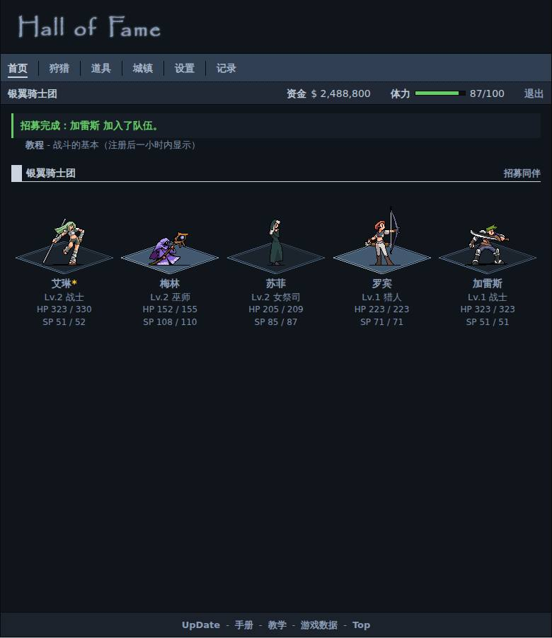 | 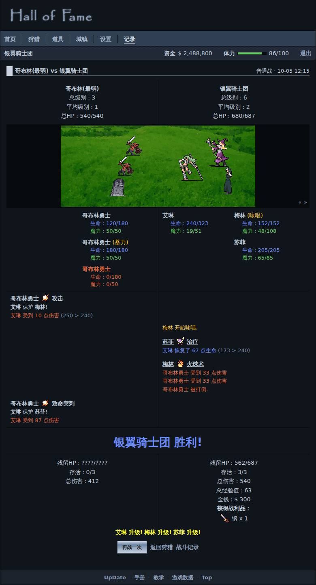 | 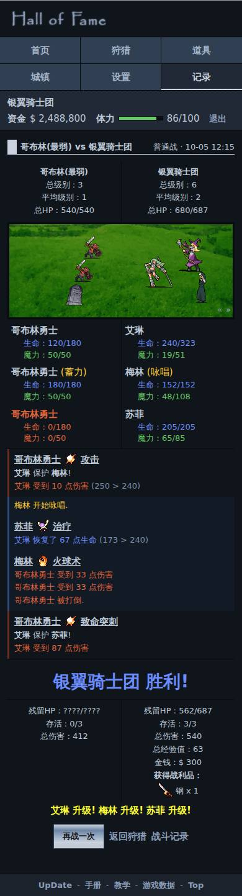 | 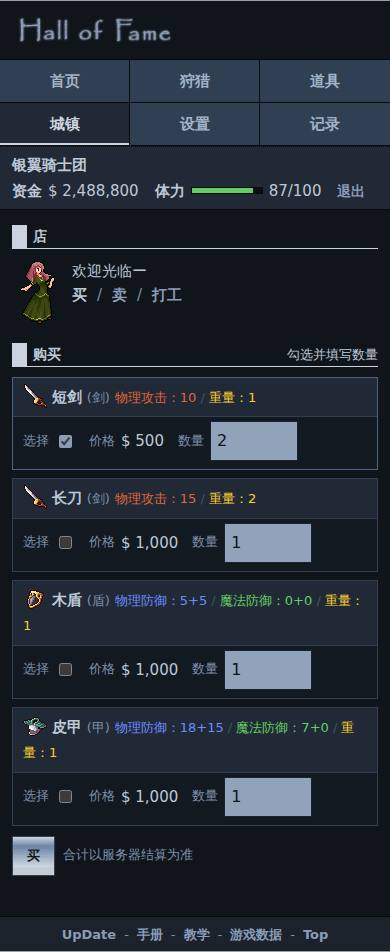 |

| 建议：角色 | 建议：拍卖 | 建议：城镇 | 建议：访客首页 |
| --- | --- | --- | --- |
| 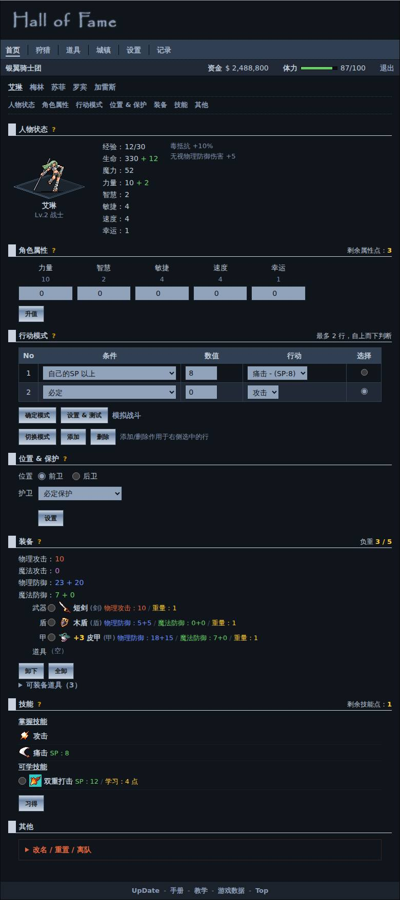 | 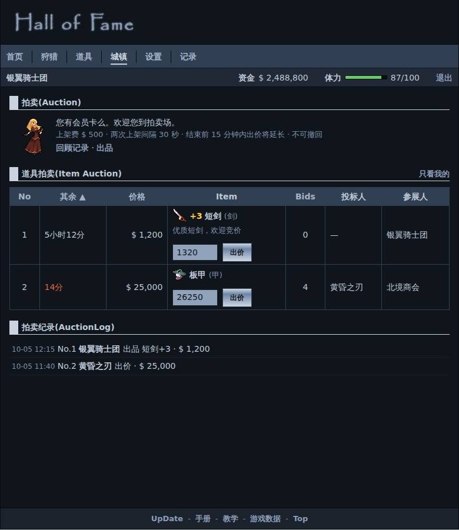 | 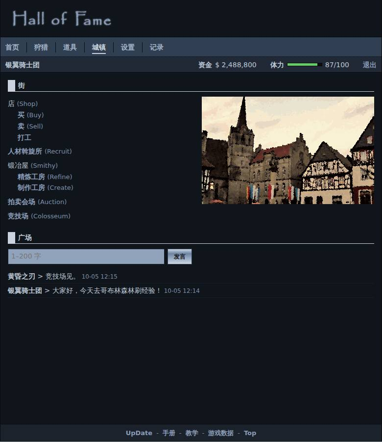 | 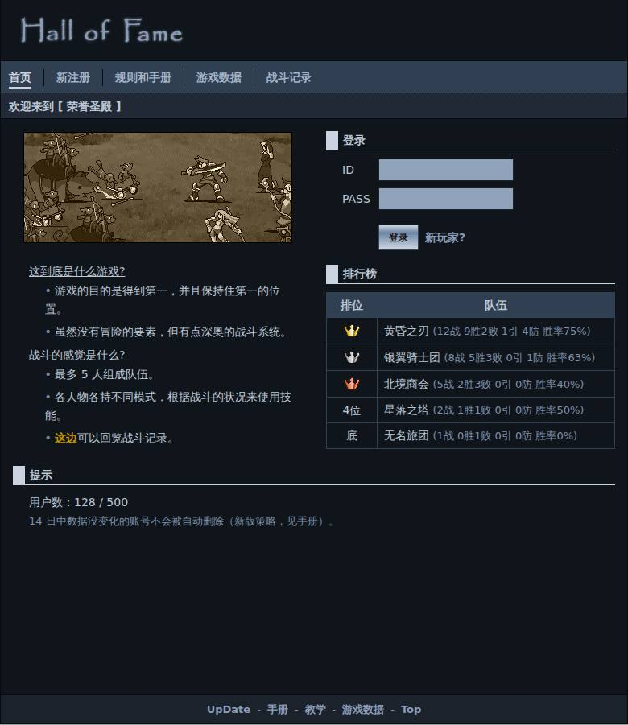 |
